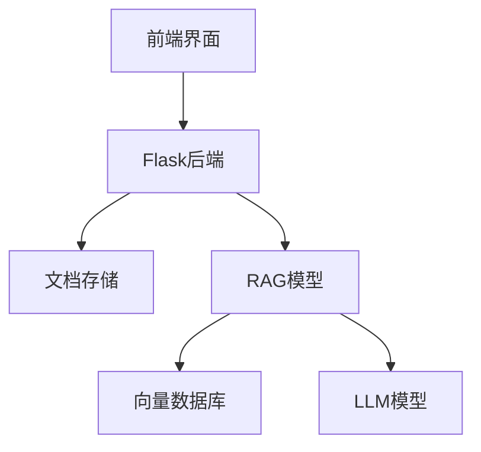

# 安全文档管理系统

## 系统概述

本系统是一个基于**RAG技术**的智能文档管理平台，集成了现代化的Web界面和人工智能问答功能。

## 主要功能

### 1. 用户管理
- **身份验证**：基于JWT令牌的安全登录
- **角色控制**：支持管理员和普通用户角色
- **权限管理**：细粒度的操作权限控制

### 2. 文档管理
- **多格式支持**：支持TXT、MD、PDF、DOC等多种文档格式
- **分级存储**：
  - `documents/` - 普通文档存储
  - `secure_documents/` - 机密文档存储
- **完整CRUD**：上传、下载、查看、删除文档

### 3. 智能问答
- **RAG技术**：基于检索增强生成的智能回答
- **实时对话**：支持流式输出，实时显示思考过程
- **Markdown渲染**：支持富文本格式的回答显示

## 技术架构

### 前端技术栈
- **框架**：Bootstrap 5 + 原生JavaScript
- **样式**：响应式设计，Material Design风格
- **功能**：单页应用，实时更新

### 后端技术栈
- **框架**：Python Flask
- **认证**：JWT令牌
- **存储**：文件系统 + PostgreSQL
- **AI模型**：集成RAG技术栈

## 安全特性

### 访问控制
1. **身份验证**：所有API都需要有效的JWT令牌
2. **角色权限**：基于用户角色的功能访问控制
3. **文档分级**：机密文档仅管理员可访问

### 数据安全
- **加密存储**：敏感数据加密保存
- **安全传输**：HTTPS协议传输
- **访问审计**：记录所有操作日志

## 使用指南

### 快速开始
1. **登录系统**：使用admin/admin123登录
2. **上传文档**：在文档管理页面上传知识库文档
3. **智能问答**：基于上传的文档进行智能问答

### 高级功能
- **批量上传**：支持多文件同时上传
- **文档搜索**：快速定位特定文档
- **对话历史**：保存问答记录
- **导出功能**：导出对话记录和文档

## 示例对话

**用户**: 系统有哪些安全功能？

**AI助手**: 根据文档内容，系统的安全功能包括：

1. **身份验证与授权**
   - JWT令牌认证
   - 多因素认证支持
   - 角色权限控制

2. **数据保护**
   - 文档分级管理
   - 加密存储
   - 安全传输

3. **访问控制**
   - 最小权限原则
   - 操作审计日志
   - 异常行为监控

---

*最后更新：2024年1月*
*文档版本：v1.0* 